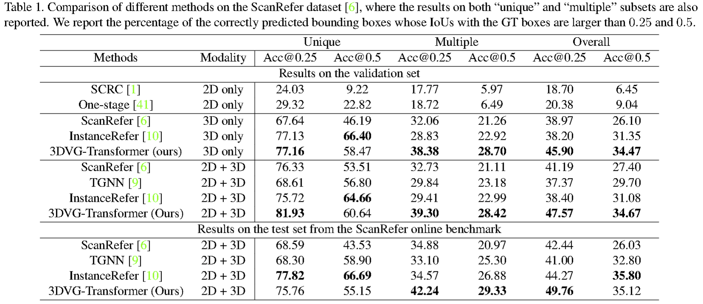

# 3DVG-Transformer

This repository is for the **ICCV 2021** paper "[3DVG-Transformer: Relation Modeling for Visual Grounding on Point Clouds](https://openaccess.thecvf.com/content/ICCV2021/papers/Zhao_3DVG-Transformer_Relation_Modeling_for_Visual_Grounding_on_Point_Clouds_ICCV_2021_paper.pdf)"  

Our method "3DVG-Transformer+" is the **1st method** on the [ScanRefer benchmark](http://kaldir.vc.in.tum.de/scanrefer_benchmark/) (2021/3 - 2021/11) and is the **winner** of the CVPR2021 [1st Workshop on Language for 3D Scenes](https://language3dscenes.github.io/)

:star2: 3DVG-Transformer+ achieves comparable results with papers published in [CVPR2022]. :star2:


## Introduction

Visual grounding on 3D point clouds is an emerging vision and language task that benefits various applications in understanding the 3D visual world. By formulating this task as a grounding-by-detection problem, lots of recent works focus on how to exploit more powerful detectors and comprehensive language features, but (1) how to model complex relations for generating context-aware object proposals and (2) how to leverage proposal relations to distinguish the true target object from similar proposals are not fully studied yet. Inspired by the well-known transformer architecture, we propose a relation-aware visual grounding method on 3D point clouds, named as 3DVG-Transformer, to fully utilize the contextual clues for relation-enhanced proposal generation and cross-modal proposal disambiguation, relation-aware proposal generation and cross-modal feature fusion, which are enabled by a newly designed coordinate-guided contextual aggregation (CCA) module in the object proposal generation stage, and a multiplex attention (MA) module in the cross-modal feature fusion stage. With the aid of two proposed feature augmentation strategies to alleviate overfitting, we validate that our 3DVG-Transformer outperforms the state-of-the-art methods by a large margin, on two point cloud-based visual grounding datasets, ScanRefer and Nr3D/Sr3D from ReferIt3D, especially for complex scenarios containing multiple objects of the same category.


## Dataset & Setup

### Data preparation

*This codebase is built based on the initial [ScanRefer](https://github.com/daveredrum/ScanRefer) codebase. Please refer to [ScanRefer](https://github.com/daveredrum/ScanRefer) for more data preprocessing details.*

1. Download the ScanRefer dataset and unzip it under `data/`. 
2. Downloadand the preprocessed [GLoVE embeddings (~990MB)](http://kaldir.vc.in.tum.de/glove.p) and put them under `data/`.
3. Download the ScanNetV2 dataset and put (or link) `scans/` under (or to) `data/scannet/scans/` (Please follow the [ScanNet Instructions](data/scannet/README.md) for downloading the ScanNet dataset).

> After this step, there should be folders containing the ScanNet scene data under the `data/scannet/scans/` with names like `scene0000_00`

4. Pre-process ScanNet data. A folder named `scannet_data/` will be generated under `data/scannet/` after running the following command. Roughly 3.8GB free space is needed for this step:

```shell
cd data/scannet/
python batch_load_scannet_data.py
```

> After this step, you can check if the processed scene data is valid by running:
>
> ```shell
> python visualize.py --scene_id scene0000_00
> ```

5. (Optional) Pre-process the **multiview features** from ENet.

- Download:
    Download the ENet [multiview features (~36GB, hdf5 database)](http://kaldir.vc.in.tum.de/enet_feats.hdf5) and put it under `data/scannet/scannet_data/`

- Projection:

   a. Download [the ENet pretrained weights (1.4MB)](http://kaldir.vc.in.tum.de/ScanRefer/scannetv2_enet.pth) and put it under `data/`
   b. Download and decompress [the extracted ScanNet frames (~13GB)](http://kaldir.vc.in.tum.de/3dsis/scannet_train_images.zip).
   c. Change the data paths in `lib/config.py` marked with __TODO__ accordingly.
   d. Project ENet features from ScanNet frames to point clouds (~36GB, hdf5 database).


> ```shell
> python script/project_multiview_features.py --maxpool
> ```

### Setup
The code is tested on Ubuntu 16.04 LTS & 18.04 LTS with PyTorch 1.2.0 CUDA 10.0 installed.

Please refer to the initial [ScanRefer](https://daveredrum.github.io/ScanRefer/) for **pointnet2 packages** for the newer version (>=1.3.0) of PyTorch.

You could use other PointNet++ implementations for the lower version (<=1.2.0) of PyTorch.

```shell
conda install pytorch==1.2.0 torchvision==0.4.0 cudatoolkit=10.0 -c pytorch
```

Install the necessary packages listed out in `requirements.txt`:
```shell
pip install -r requirements.txt
```
After all packages are properly installed, please run the following commands to compile the CUDA modules for the PointNet++ backbone:
```shell
cd lib/pointnet2
python setup.py install
```
__Before moving on to the next step, please don't forget to set the project root path to the `CONF.PATH.BASE` in `lib/config.py`.__

## Usage

### Training
To train the 3DVG-Transformer model with multiview features:
```shell
python scripts/ScanRefer_train.py --use_multiview --use_normal --batch_size 8 --epoch 200 --lr 0.002 --coslr --tag 3dvg-trans+
```
settings:
XYZ: --use_normal
XYZ+RGB: --use_color --use_normal
XYZ+Multiview: --use_multiview --use_normal

For more training options (like using preprocessed multiview features), please run `scripts/train.py -h`.

### Evaluation
To evaluate the trained models, please find the folder under `outputs/` and run:
```shell
python scripts/ScanRefer_eval.py --folder <folder_name> --reference --use_multiview --no_nms --force --repeat 5
```
Note that the flags must match the ones set before training. The training information is stored in `outputs/<folder_name>/info.json`

### Benchmark Challenge 

**Note that every user is allowed to submit the test set results of each method *only twice*, and the ScanRefer benchmark blocks update the test set results of a method for two weeks after a test set submission.**

After finishing training the model, please download [the benchmark data](http://kaldir.vc.in.tum.de/scanrefer_benchmark_data.zip) and put the unzipped `ScanRefer_filtered_test.json` under `data/`. Then, you can run the following script the generate predictions:

```shell
python benchmark/predict.py --folder <folder_name> --use_color
```

Note that the flags must match the ones set before training. The training information is stored in `outputs/<folder_name>/info.json`. The generated predictions are stored in `outputs/<folder_name>/pred.json`.
For submitting the predictions, please compress the `pred.json` as a .zip or .7z file and follow the [instructions](http://kaldir.vc.in.tum.de/scanrefer_benchmark/documentation) to upload your results.

### Visualization


To predict the localization results predicted by the trained ScanRefer model in a specific scene, please find the corresponding folder under `outputs/` with the current timestamp and run:

```shell
python scripts/visualize.py --folder <folder_name> --scene_id <scene_id> --use_color
```
Note that the flags must match the ones set before training. The training information is stored in `outputs/<folder_name>/info.json`. The output `.ply` files will be stored under `outputs/<folder_name>/vis/<scene_id>/`

In our next version, the heatmap visualization code will be open-sourced in the 3DJCG (CVPR2022, Oral) codebase. 

The generated .ply or .obj files could be visualized in software such as **MeshLab**.

### Results



settings:
3D Only (XYZ+RGB): --use_color --use_normal
2D+3D (XYZ+Multiview): --use_multiview --use_normal

|             Validation Set             |             |          |  Unique  |  Unique | Multiple | Multiple |  Overall | Overall |
|:--------------------------------------:|:-----------:|:--------:|:--------:|:-------:|:--------:|:--------:|:--------:|:-------:|
|                 Methods                | Publication | Modality | Acc@0.25 | Acc@0.5 | Acc@0.25 |  Acc@0.5 | Acc@0.25 | Acc@0.5 |
|                  SCRC                  |    CVPR16   |    2D    |   24.03  |   9.22  |   17.77  |   5.97   |   18.70  |   6.45  |
|                One-Stage               |    ICCV19   |    2D    |   29.32  |  22.82  |   18.72  |   6.49   |   20.38  |   9.04  |
|                                        |             |          |          |         |          |          |          |         |
|                ScanRefer               |   ECCV2020  |    3D    |   67.64  |  46.19  |   32.06  |   21.26  |   38.97  |  26.10  |
|                  TGNN                  |   AAAI2021  |    3D    |   68.61  |  56.80  |   29.84  |   23.18  |   37.37  |  29.70  |
|              InstanceRefer             |   ICCV2021  |    3D    |   77.45  |  66.83  |   31.27  |   24.77  |   40.23  |  32.93  |
|                   SAT                  |   ICCV2021  |    3D    |   73.21  |  50.83  |   37.64  |   25.16  |   44.54  |  30.14  |
|         3DVG-Transformer (ours)        |   ICCV2021  |    3D    |   77.16  |  58.47  |   38.38  |   28.70  |   45.90  |  34.47  |
|               BEAUTY-DETR              |      -      |    3D    |     -    |    -    |     -    |     -    |   46.40  |    -    |
|                  3DJCG                 |   CVPR2022  |    3D    |   78.75  |  61.30  |   40.13  |   30.08  |   47.62  |  36.14  |
|                 3D-SPS                 |   CVPR2022  |    3D    |   81.63  |  64.77  |   39.48  |   29.61  |   47.65  |  36.43  |
|                                        |             |          |          |         |          |          |          |         |
|                ScanRefer               |   ECCV2020  |  2D + 3D |   76.33  |  53.51  |   32.73  |   21.11  |   41.19  |  27.40  |
|                  TGNN                  |   AAAI2021  |  2D + 3D |   68.61  |  56.80  |   29.84  |   23.18  |   37.37  |  29.70  |
|              InstanceRefer             |   ICCV2021  |  2D + 3D |   75.72  |  64.66  |   29.41  |   22.99  |   38.40  |  31.08  |
|         3DVG-Transformer (Ours)        |   ICCV2021  |  2D + 3D |   81.93  |  60.64  |   39.30  |   28.42  |   47.57  |  34.67  |
| 3DVG-Transformer+(Ours, this codebase) |      -      |  2D + 3D |   83.25  |  61.95  |   41.20  |   30.29  |   49.36  |  36.43  |
|                  3DJCG                 |   CVPR2022  |  2D + 3D |   83.47  |  64.34  |   41.39  |   30.82  |   49.56  |  37.33  |
|                 3D-SPS                 |   CVPR2022  |  2D + 3D |   84.12  |  66.72  |   40.32  |   29.82  |   48.82  |  36.98  |

|     Online Benchmark    |          |  Unique  |  Unique | Multiple | Multiple |  Overall | Overall |
|:-----------------------:|:--------:|:--------:|:-------:|:--------:|:--------:|:--------:|:-------:|
|         Methods         | Modality | Acc@0.25 | Acc@0.5 | Acc@0.25 |  Acc@0.5 | Acc@0.25 | Acc@0.5 |
|        ScanRefer        |  2D + 3D |   68.59  |  43.53  |   34.88  |   20.97  |   42.44  |  26.03  |
|           TGNN          |  2D + 3D |   68.34  |  58.94  |   33.12  |   25.26  |   41.02  |  32.81  |
|      InstanceRefer      |  2D + 3D |   77.82  |  66.69  |   34.57  |   26.88  |   44.27  |  35.80  |
| 3DVG-Transformer (Ours) |  2D + 3D |   75.76  |  55.15  |   42.24  |   29.33  |   49.76  |  35.12  |
| 3DVG-Transformer+(Ours) |  2D + 3D |   77.33  |  57.87  |   43.70  |   31.02  |   51.24  |  37.04  |


## Changelog

2022/04: Update Readme.md.

2022/04: Release the codes of 3DVG-Transformer.

2021/07: 3DVG-Transformer is accepted at ICCV 2021.

2021/06: 3DVG-Transformer+ won the ScanRefer Challenge in the CVPR2021 [1st Workshop on Language for 3D Scenes](https://language3dscenes.github.io/).

2021/04: 3DVG-Transformer+ achieves 1st place in [ScanRefer Leaderboard](http://kaldir.vc.in.tum.de/scanrefer_benchmark/).

## Citation

If you use the codes in your work, please kindly cite our work 3DVG-Transformer and the original ScanRefer paper:

```
@inproceedings{zhao2021_3DVG_Transformer,
    title={{3DVG-Transformer}: Relation modeling for visual grounding on point clouds},
    author={Zhao, Lichen and Cai, Daigang and Sheng, Lu and Xu, Dong},
    booktitle={ICCV},
    pages={2928--2937},
    year={2021}
}

@article{chen2020scanrefer,
    title={{ScanRefer}: 3D Object Localization in RGB-D Scans using Natural Language},
    author={Chen, Dave Zhenyu and Chang, Angel X and Nie{\ss}ner, Matthias},
    pages={202--221},
    journal={ECCV},
    year={2020}
}
```

## Acknowledgement
We would like to thank [facebookresearch/votenet](https://github.com/facebookresearch/votenet) for the 3D object detection codebase and [erikwijmans/Pointnet2_PyTorch](https://github.com/erikwijmans/Pointnet2_PyTorch) for the CUDA accelerated PointNet++ implementation.

For further acceleration, you could use [KD-Tree](https://github.com/zlccccc/3dpoint_cuda_kdtree) to accelerate the PointNet++ process.

## License

This repository is released under MIT License (see LICENSE file for details).
